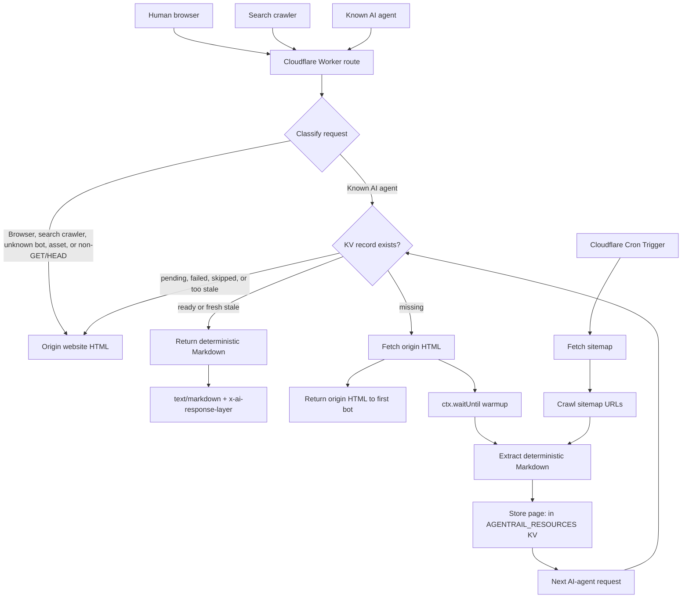

# AgentRail

AgentRail gives known AI agents deterministic Markdown responses from the same URLs humans already visit. It can run at the edge through Cloudflare Workers or inside Node.js applications as middleware.

```txt
Browser or search crawler -> /pricing -> origin HTML
Known AI agent           -> /pricing -> generated Markdown if ready
Known AI agent           -> /pricing -> origin HTML if Markdown is unavailable
```

The crawler runs in the background. Request handling never waits for extraction, so cache misses fall through to the original site without adding generation latency.
When a known AI agent requests a page that is not in KV yet, AgentRail returns the origin page and uses `ctx.waitUntil` to warm KV from that same origin response. A later AI-agent request can then receive the prepared Markdown.

## E2E Flow



## What It Includes

- `@agentrail/bot-detector`: classifies AI agents, search crawlers, browsers, and unknown bots.
- `@agentrail/markdown-extractor`: deterministic HTML to Markdown extraction.
- `@agentrail/crawler`: sitemap parsing, link discovery, resource keys, and crawl processing.
- `@agentrail/runtime`: platform-neutral request handling and warmup rules.
- `@agentrail/worker`: Cloudflare Worker runtime.
- `@agentrail/node`: Node.js middleware adapters for Express and Nest-style apps.
- `create-agentrail`: scaffold generator for Cloudflare projects.

## Quick Test

AgentRail expects Node 22 or newer. Current Wrangler 4 releases require it.

```bash
npm test
```

The repository uses Node's built-in test runner and has no runtime test dependency.

## Generate A Site Project

From this repository:

```bash
node --import tsx packages/create-agentrail/bin/create-agentrail.ts my-site \
  --origin=https://example.com \
  '--route=example.com/*' \
  --schedule="0 */6 * * *"
```

The CLI checks Cloudflare through Wrangler, reuses an existing `AGENTRAIL_RESOURCES` KV namespace if one is present, or creates it automatically if it is missing. When that setup succeeds, the generated project contains a Wrangler-compatible Worker entrypoint and config with the real KV namespace id already written into `wrangler.jsonc`. If automatic setup is skipped or fails, the config keeps a placeholder and the generated README explains the manual KV setup.

It also runs `npm install` inside the generated project by default, so the normal next step is deploy:

```bash
cd my-site
npm run deploy
```

AgentRail includes a Cron Trigger for background crawling. On a fresh Cloudflare account, open the Cloudflare dashboard and visit Workers & Pages once before the first deploy. Cloudflare creates the required `workers.dev` subdomain there. If `npm run deploy` fails with Cloudflare `code: 10063`, do that dashboard step and rerun the deploy command.

If you want to generate files only:

```bash
node --import tsx packages/create-agentrail/bin/create-agentrail.ts my-site \
  --origin=https://example.com \
  '--route=example.com/*' \
  --skip-install
```

If you are offline, not logged into Wrangler, or want to wire Cloudflare later:

```bash
node --import tsx packages/create-agentrail/bin/create-agentrail.ts my-site \
  --origin=https://example.com \
  '--route=example.com/*' \
  --skip-cloudflare
```

The generated `wrangler.jsonc` will contain this placeholder until you add the real KV namespace id:

```json
{
  "binding": "AGENTRAIL_RESOURCES",
  "id": "replace-with-agentrail-resources-kv-id"
}
```

If you already have a namespace id:

```bash
node --import tsx packages/create-agentrail/bin/create-agentrail.ts my-site \
  --origin=https://example.com \
  '--route=example.com/*' \
  --kv-id=your-kv-namespace-id
```

## Manual KV Namespace Setup

Use this when automatic Cloudflare setup was skipped or failed.

First make sure Wrangler is logged in:

```bash
npx wrangler login
```

Check whether the namespace already exists:

```bash
npx wrangler kv namespace list --json
```

If the output includes a namespace with `"title": "AGENTRAIL_RESOURCES"`, copy its `"id"`.

If it does not exist, create it:

```bash
npx wrangler kv namespace create AGENTRAIL_RESOURCES
```

Wrangler prints an id. It may look like this:

```txt
id = "abc123..."
```

Paste that id into `wrangler.jsonc`:

```json
{
  "kv_namespaces": [
    {
      "binding": "AGENTRAIL_RESOURCES",
      "id": "abc123..."
    }
  ]
}
```

Then deploy:

```bash
npm install
npm run deploy
```

Generated projects are local deployment workspaces. Keep them under `projects/`; that folder is ignored so your site-specific Cloudflare config does not get committed to the AgentRail source repo.

## Deploy This Worker Directly

Copy the example config and edit the route and origin:

```bash
cp wrangler.example.jsonc wrangler.jsonc
```

Follow the manual KV setup above if `AGENTRAIL_RESOURCES` is not configured yet, then deploy:

```bash
npm install
npm run deploy
```

If this is the first Worker on the Cloudflare account, open Workers & Pages in the Cloudflare dashboard once before deploying so Cloudflare creates the required `workers.dev` subdomain for cron schedules.

## Runtime Contract

AgentRail only returns Markdown when a stored resource is safe to serve:

- `ready`: return Markdown.
- `stale`: return Markdown only inside the configured stale window.
- `missing`, `pending`, `failed`, `skipped`, or too stale: pass through to origin.

Humans, traditional search crawlers, unknown bots, assets, and non-GET/HEAD requests always pass through to origin.
Known AI-agent GET requests with no KV record also schedule a background warmup from the origin response before passing through. That keeps the first miss fast and prepares the next bot request.

## Node.js Middleware

For non-Cloudflare deployments, install the Node adapter in the application that serves your website and mount it before your normal routes.

```ts
import express from "express";
import { createAgentRailMiddleware, createFileResourceStore } from "@agentrail/node";

const app = express();

app.use(createAgentRailMiddleware({
  origin: "https://example.com",
  store: createFileResourceStore({ directory: ".agentrail/resources" })
}));

app.get("/pricing", (_request, response) => {
  response.type("html").send("<main><h1>Pricing</h1></main>");
});
```

NestJS can use the same adapter through `app.use(...)`:

```ts
import { NestFactory } from "@nestjs/core";
import { createNestAgentRailMiddleware, createFileResourceStore } from "@agentrail/node";
import { AppModule } from "./app.module";

const app = await NestFactory.create(AppModule);

app.use(createNestAgentRailMiddleware({
  origin: "https://example.com",
  store: createFileResourceStore({ directory: ".agentrail/resources" })
}));

await app.listen(3000);
```

The file-backed store is intended for local and small self-hosted trials. Production Node deployments should use a durable store adapter such as Postgres, Redis, DynamoDB, or Cloud SQL as those packages are added.

## Self-Hosted And Cloud Presets

The platform-neutral runtime is the base for non-Cloudflare deployments:

- Docker gateway: run AgentRail as a reverse proxy in front of an origin app.
- AWS: run the Docker gateway on ECS/Fargate or behind an ALB, with EventBridge/SQS for scheduled crawl work.
- GCP: run the Docker gateway on Cloud Run, with Cloud Scheduler/Pub/Sub for scheduled crawl work.
- Kubernetes: run the gateway and crawler worker as separate deployments with a shared durable store.

Those presets should reuse `@agentrail/runtime` so request behavior remains identical across Cloudflare, Node middleware, and container deployments.

## Default AI-Agent Bots

AgentRail treats these user agents as AI-agent traffic by default:

```txt
Applebot
GPTBot
ChatGPT-User
OAI-SearchBot
Google-CloudVertexBot
Claude (versioned Claude/1.0 style user agents)
ClaudeBot
Claude-User
Claude-SearchBot
Anthropic-AI
PerplexityBot
Perplexity-User
YouBot
Cohere-AI
Amazonbot
Anchor Browser
Bytespider
Cloudflare Crawler
CCBot
DuckAssistBot
FacebookBot
Manus Bot
Meta-ExternalAgent
Meta-ExternalFetcher
MistralAI-User
Novellum AI Crawl
PetalBot
ProRataInc
TikTok Spider
Timpibot
```

Googlebot, Bingbot, DuckDuckBot, YandexBot, Baiduspider, archive.org_bot, Arquivo Web Crawler, Terracotta Bot, Slurp, and other traditional search crawlers stay on the origin path.

## Basic Cloudflare Mode

The basic mode uses:

- Worker routes for request switching.
- Cron Trigger for sitemap crawling.
- KV namespace named `AGENTRAIL_RESOURCES` for Markdown records.
- Request-time warmup for AI-agent misses.
- Persisted Worker logs through Cloudflare observability.

Cron can crawl sitemap pages directly into KV. A production deployment can add Queues and D1 later, but they are not required for the first useful version.

Local Wrangler does not run Cron Triggers by itself. AgentRail's dev script uses `--test-scheduled`, so you can run `npm run dev` and trigger the crawler manually:

```bash
curl "http://localhost:8787/__scheduled?cron=0+*/6+*+*+*"
```

For deployed Workers, AgentRail enables persisted logs and invocation logs in `wrangler.jsonc`. Use `npm run tail` or the Cloudflare dashboard logs view to inspect requests while testing.

## Generated Markdown

Each record stores Markdown with this shape:

```md
# Page Title

Canonical URL: https://example.com/page
Last generated: 2026-06-03T00:00:00.000Z
Source: public HTML

## Description
Meta description or first meaningful paragraph.

## Content
Clean extracted page content.
```

The extractor preserves source ordering where practical and does not use LLM summarization.

## License

Apache-2.0. See [LICENSE](LICENSE).
